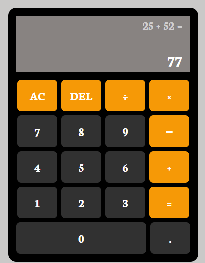

# Calculator

 

A functional calculator that performs basic mathematical operations.

## About 

This project is part of the Foundations JavaScript section of [The Odin Project](https://www.theodinproject.com/lessons/foundations-calculator) curriculum.

## Features

- Basic operations (addition, subtraction, multiplication, division)
- Clear and equals functionality
- Decimal point support